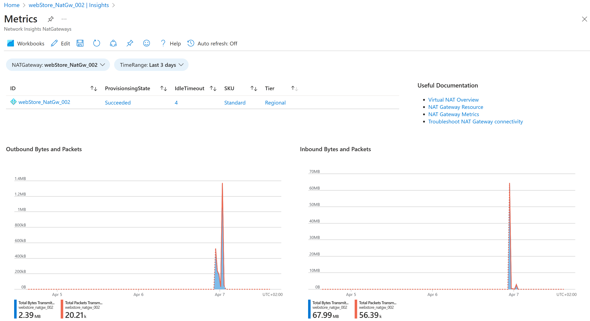
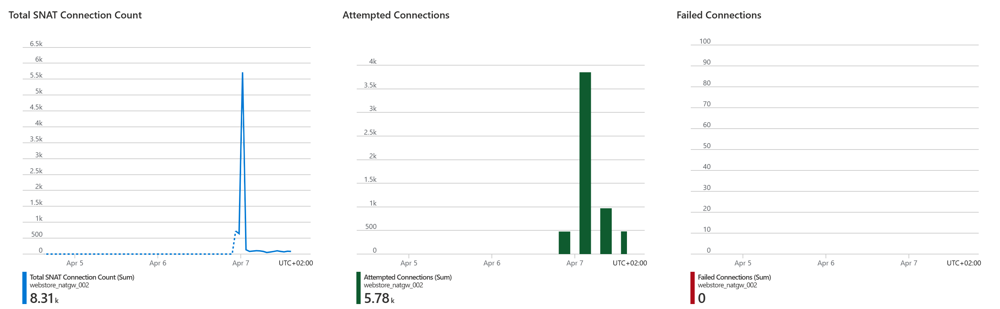

# VM With NAT Gateway - WIP

Azure VM With NAT Gateway to route internet traffic securely and avoid SNAT port exhaustion issues.

1. ## 🧰 Prerequisites

   This demo, instructions, scripts and bicep template is designed to be run in `westeurope`. With few or no modifications you can try it out in other regions as well(_Not covered here_).

   - 🛠 Azure CLI Installed & Configured - [Get help here](https://learn.microsoft.com/en-us/cli/azure/install-azure-cli)
   - 🛠 Bicep Installed & Configured - [Get help here](https://learn.microsoft.com/en-us/azure/azure-resource-manager/bicep/install)
   - 🛠 VS Code & Bicep Extenstions - [Get help here](https://learn.microsoft.com/en-us/azure/azure-resource-manager/bicep/install#vs-code-and-bicep-extension)

1. ## ⚙️ Setting up the environment

   - Get the application code

     ```bash
     https://github.com/miztiik/custom-metrics-to-azure-monitor
     cd custom-metrics-to-azure-monitor
     ```

1. ## 🚀 Prepare the environment

   Let check you have Azure Cli working with 

    ```bash
      # You should have azure cli preinstalled
      az account show
    ```

    You should see an output like this,

   ```json
    {
      "environmentName": "AzureCloud",
      "homeTenantId": "16b30820b6d3",
      "id": "1ac6fdbff37cd9e3",
      "isDefault": true,
      "managedByTenants": [],
      "name": "YOUR-SUBS-NAME",
      "state": "Enabled",
      "tenantId": "16b30820b6d3",
      "user": {
        "name": "miztiik@",
        "type": "user"
      }
    }
   ```

1. ## 🚀 Deploying the application

    - **Register an App to Azure AD** - Doc Ref<sup>[3]</sup>
      - Create the client secret as well. Note down its value, as it is only shown during the creation time.
    - **Create & Authorize a Service Principal to emit metrics** (_preferably a VM/FunctionApp_)Doc Ref<sup>[4]</sup>
      - Follow the rest of the instructions
    - **Get Auth Token**:

        ```bash
        #Get TenantID
        az account show
        # or
        az account tenant list
        ```

   - **Stack: Main Bicep**
     The params required for the modules are in `params.json`. Do modify them to suit your need.(_Especially the `adminPassword.secureString` for the VM. You are strongly encouraged to Just-In-Time access or use SSH key instead of password based authentication_). The helper deployment script `deploy.sh` will deploy the `main.bicep` file. This will inturn call the modules for Resource Group(RG), VNet & Virtual Machine & NAT Gateway.

     ```bash
     sh deploy.sh
     ```

     At this moment, i couldn't find a elegant way of creating the NATGW and associating with an existing subnet with bicep.(_Do let me know if you know how to do it)_

    **Associate NAT with subnet**
    
    ```bash
    az network vnet subnet update \
      --resource-group [myResourceGroup] \
      --vnet-name [myVnet] \  
      --name [myIntegrationSubnet] \
      --nat-gateway myNATgateway
    ```


1. ## 🔬 Testing the solution

   - **Connect to the VM**

      Chart the metric from Azure Monitor Portal

      
      
      
  

image.png

1. ## 📒 Conclusion

    Here we have demonstrated how to deploy NAT Gateway and route internet traffic through it.
  

1. ## 🧹 CleanUp

If you want to destroy all the resources created by the stack, Execute the below command to delete the stack, or _you can delete the stack from console as well_

- Resources created during [Deploying The Application](#-deploying-the-application)
- _Any other custom resources, you have created for this demo_

```bash
# Delete from resource group
az group delete --name Miztiik_Enterprises_xxx --yes
# Follow any on-screen prompt
```

This is not an exhaustive list, please carry out other necessary steps as maybe applicable to your needs.

## 📌 Who is using this

This repository aims to show how to Bicep to new developers, Solution Architects & Ops Engineers in Azure.

### 💡 Help/Suggestions or 🐛 Bugs

Thank you for your interest in contributing to our project. Whether it is a bug report, new feature, correction, or additional documentation or solutions, we greatly value feedback and contributions from our community. [Start here](/issues)

### 👋 Buy me a coffee

[](https://ko-fi.com/Q5Q41QDGK) Buy me a [coffee ☕][900].

### 📚 References


1. [Azure Docs: Design virtual networks with NAT gateway][1]


### 🏷️ Metadata


**Level**: 100

[1]: https://learn.microsoft.com/en-us/azure/virtual-network/nat-gateway/nat-gateway-resource


[100]: https://www.udemy.com/course/aws-cloud-security/?referralCode=B7F1B6C78B45ADAF77A9
[101]: https://www.udemy.com/course/aws-cloud-security-proactive-way/?referralCode=71DC542AD4481309A441
[102]: https://www.udemy.com/course/aws-cloud-development-kit-from-beginner-to-professional/?referralCode=E15D7FB64E417C547579
[103]: https://www.udemy.com/course/aws-cloudformation-basics?referralCode=93AD3B1530BC871093D6
[899]: https://www.udemy.com/user/n-kumar/
[900]: https://ko-fi.com/miztiik
[901]: https://ko-fi.com/Q5Q41QDGK